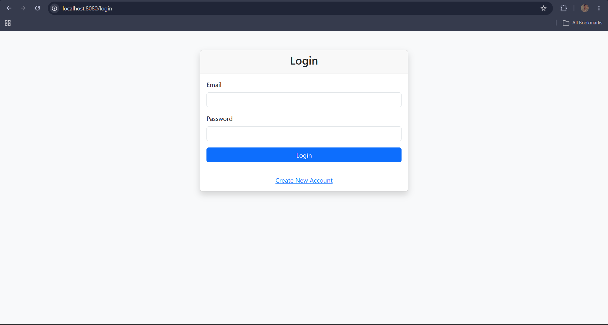
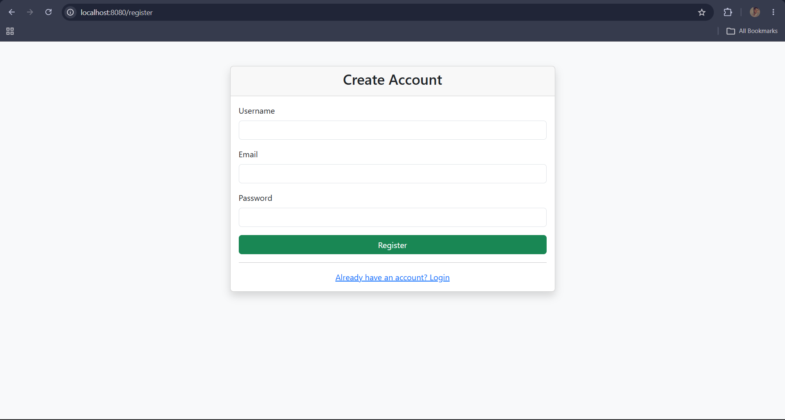
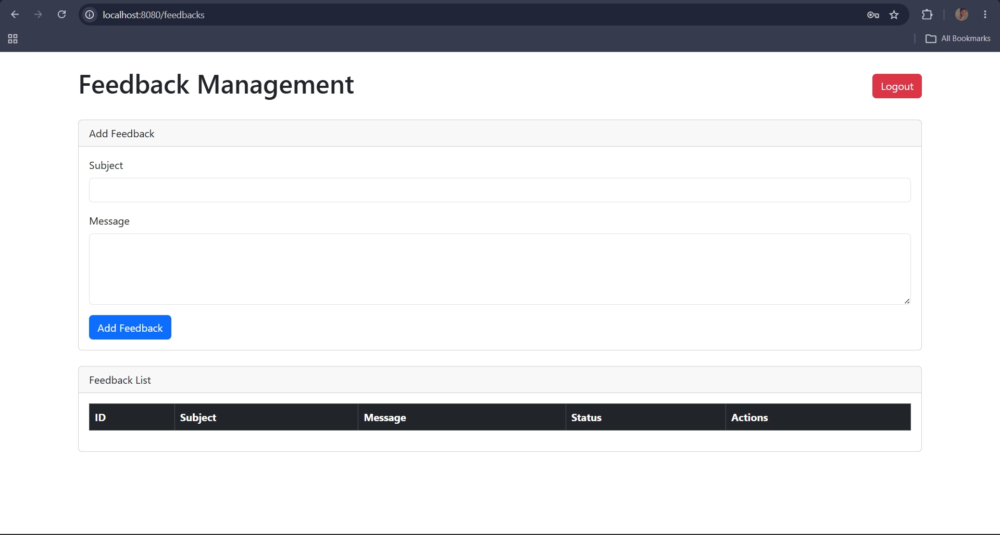
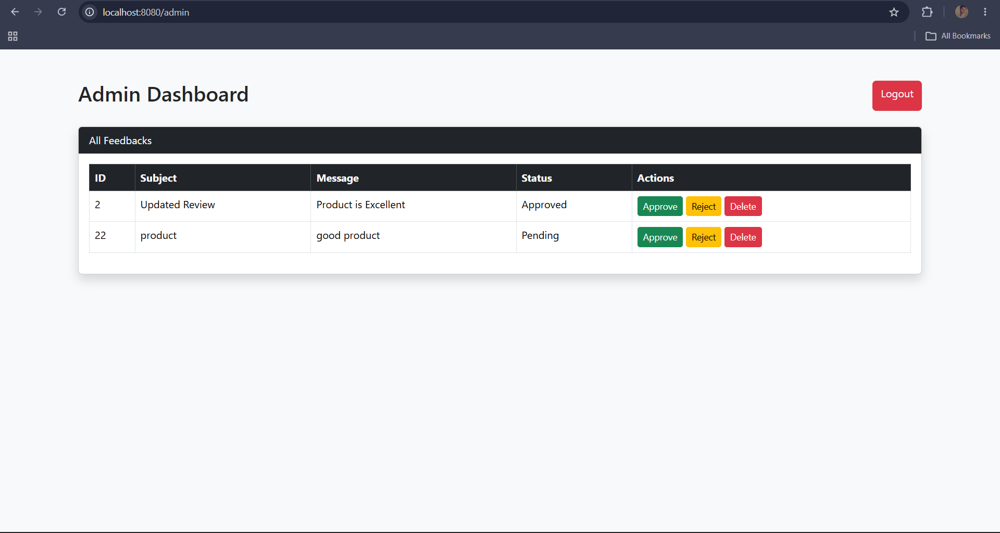

# 📝 Role-Based Feedback Management System
<p align="center">


</p>

<p align="center">


</p>

---

# 📖 Overview

The **Feedback Management System** is a secure role-based web application built using **Java, Spring Boot, Spring Security, Hibernate/JPA, Thymeleaf, Bootstrap, and MySQL**.

The application allows users to register, log in securely, submit feedback, edit or delete their own feedback, while administrators can review, approve, reject, and manage all submitted feedback.

The project follows a clean layered architecture using the **Controller → Service → Repository** pattern and implements secure authentication using **Spring Security** with **BCrypt Password Encoding**.

---

# 🚀 Features

## 👤 User

- User Registration
- Secure Login
- Submit Feedback
- View Personal Feedback
- Edit Feedback
- Delete Feedback
- Logout

---

## 👨‍💼 Admin

- Admin Login
- View All Feedback
- Approve Feedback
- Reject Feedback
- Delete Feedback
- Role-Based Authorization
- Logout

---

## ⚙ Technical Features

- Spring Boot MVC
- Spring Security
- Hibernate / JPA
- Spring Data JPA
- MySQL Database Integration
- Thymeleaf Template Engine
- Bootstrap Responsive UI
- BCrypt Password Encryption
- Session-Based Authentication
- Form Validation
- Layered Architecture

---

# 🛠 Tech Stack

| Technology | Version |
|------------|----------|
| Java | 17 |
| Spring Boot | 3.x |
| Spring MVC | ✔ |
| Spring Security | ✔ |
| Hibernate | ✔ |
| Spring Data JPA | ✔ |
| Thymeleaf | ✔ |
| Bootstrap | 5 |
| MySQL | 8 |
| Maven | ✔ |

---

# 🏗 Application Architecture

```
                 Browser
                    │
                    ▼
        Spring Boot Controller
                    │
                    ▼
             Service Layer
                    │
                    ▼
           Repository Layer
                    │
                    ▼
             Hibernate / JPA
                    │
                    ▼
             MySQL Database
```

---

# 📂 Project Structure

```
feedback-management-system
│
├── screenshots
│   ├── login.png
│   ├── register.png
│   ├── user-dashboard.png
│   └── admin-dashboard.png
│
├── src
│   ├── main
│   │
│   ├── java
│   │   ├── controller
│   │   ├── service
│   │   ├── repository
│   │   ├── entity
│   │   ├── config
│   │   ├── dto
│   │   └── exception
│   │
│   └── resources
│       ├── static
│       ├── templates
│       └── application.properties
│
├── Dockerfile
├── pom.xml
└── README.md
```

---

# 🔐 User Roles

## USER

- Register
- Login
- Submit Feedback
- View Own Feedback
- Edit Own Feedback
- Delete Own Feedback
- Logout

---

## ADMIN

- Login
- View All Feedback
- Approve Feedback
- Reject Feedback
- Delete Any Feedback
- Logout

---

# 📸 Application Screenshots

## 🔑 Login Page



---

## 📝 Registration Page



---

## 👤 User Dashboard



---

## 👨‍💼 Admin Dashboard



---

# 🗄 Database Schema

## user_entity

| Column | Description |
|----------|-------------|
| id | Primary Key |
| username | Username |
| email | User Email |
| password | BCrypt Encrypted Password |
| role | USER / ADMIN |

---

## feedback_entity

| Column | Description |
|----------|-------------|
| id | Primary Key |
| subject | Feedback Subject |
| message | Feedback Message |
| status | Pending / Approved / Rejected |
| user_id | Foreign Key |

---

# 🔄 Application Workflow

```
User Registration
        │
        ▼
User Login
        │
        ▼
Authentication
        │
        ▼
Role Verification
        │
   ┌────┴─────────────┐
   ▼                  ▼
User Dashboard   Admin Dashboard
   │                  │
   ▼                  ▼
Manage Feedback  Review Feedback
```

---

# ⚙ Installation

## 1. Clone Repository

```bash
git clone https://github.com/avishkardhonde23-tech/feedback-management-system.git
```

---

## 2. Navigate to Project

```bash
cd feedback-management-system
```

---

## 3. Configure MySQL Database

Create a database:

```sql
CREATE DATABASE practicee;
```

Update **application.properties**

```properties
spring.datasource.url=jdbc:mysql://localhost:3306/practicee
spring.datasource.username=root
spring.datasource.password=root

spring.jpa.hibernate.ddl-auto=update
spring.jpa.show-sql=true
```

---

## 4. Build Project

```bash
mvn clean install
```

---

## 5. Run Application

```bash
mvn spring-boot:run
```

---

## 6. Open Browser

```
http://localhost:8080/login
```

---

# 🌐 Application Endpoints

| Method | Endpoint | Description |
|---------|----------|-------------|
| GET | /register | Registration Page |
| POST | /register-user | Register User |
| GET | /login | Login Page |
| POST | /login-user | Login User |
| GET | /feedbacks | User Dashboard |
| POST | /feedbacks | Submit Feedback |
| GET | /edit/{id} | Edit Feedback |
| POST | /update/{id} | Update Feedback |
| GET | /delete-feedback/{id} | Delete Feedback |
| GET | /admin | Admin Dashboard |
| GET | /approve/{id} | Approve Feedback |
| GET | /reject/{id} | Reject Feedback |
| GET | /admin/delete/{id} | Delete Feedback |
| GET | /logout | Logout |

---

# 🔒 Security

- Spring Security Authentication
- BCrypt Password Encryption
- Role-Based Authorization
- Session-Based Authentication
- Protected Routes
- Form Validation

---

# 🎯 Key Learning Outcomes

- Spring Boot MVC
- Spring Security
- Authentication & Authorization
- BCrypt Password Encoding
- Hibernate & JPA
- Spring Data JPA
- CRUD Operations
- Session Management
- Thymeleaf
- MySQL Integration
- Layered Architecture
- Exception Handling

---

# 📌 Future Improvements

- REST API Version
- JWT Authentication
- Docker Compose Support
- Swagger/OpenAPI Documentation
- Pagination & Sorting
- Search & Filter Feedback
- Unit & Integration Testing
- CI/CD Pipeline

---

# 👨‍💻 Author

## Avishkar Dhonde

- GitHub: https://github.com/avishkardhonde23-tech
- LinkedIn: https://www.linkedin.com/in/avishkardhonde23

---
